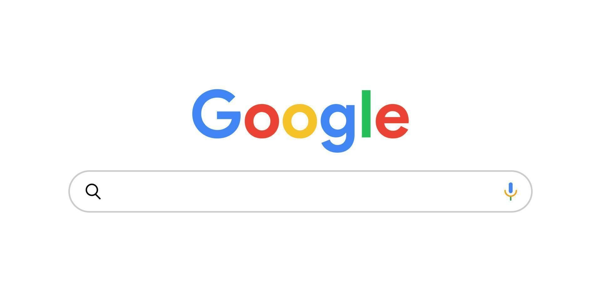

   

--- 

  <h1>✨ Google-Osint ✨</h1>

  
  
  

---
 Una guía **completa y práctica** para dominar **OSINT (Open Source Intelligence)** utilizando **Google** y sus servicios. Incluye tutoriales paso a paso 📚, técnicas avanzadas 🚀, ejemplos prácticos 💡 y consideraciones éticas cruciales ⚖️.

## 🤔 ¿Por Qué Este Repositorio?

Este repositorio busca ser un recurso **centralizado y fácil de seguir** para aprender y aplicar técnicas OSINT basadas en Google. Desde operadores de búsqueda básicos hasta el uso avanzado de servicios como Google Maps o Images, encontrarás información estructurada y ejemplos claros. El objetivo es proporcionar un **"mega tutorial"** de forma consolidada y accesible.

---

## 📂 Estructura del Repositorio

Aquí tienes una vista general de cómo está organizado el contenido:

<table>
  <thead>
    <tr>
      <th align="left">Archivo / Carpeta</th>
      <th align="left">Descripción</th>
    </tr>
  </thead>
  <tbody>
    <tr>
      <td>📁 <strong>TUTORIAL/</strong></td>
      <td>Carpeta principal con los módulos del tutorial.</td>
    </tr>
    <tr>
      <td>&nbsp;&nbsp;📄 <a href="TUTORIAL/1_Introduction_Ethics.md">1_Introduction_Ethics.md</a></td>
      <td>Introducción y consideraciones éticas (¡Leer primero!).</td>
    </tr>
    <tr>
      <td>&nbsp;&nbsp;📄 <a href="TUTORIAL/2_Google_Operators_Dorking.md">2_Google_Operators_Dorking.md</a></td>
      <td>Guía completa de operadores y Google Dorking.</td>
    </tr>
    <tr>
      <td>&nbsp;&nbsp;📄 <a href="TUTORIAL/3_Google_Services_Beyond_Search.md">3_Google_Services_Beyond_Search.md</a></td>
      <td>Uso de otros servicios de Google para OSINT.</td>
    </tr>
    <tr>
      <td>&nbsp;&nbsp;📄 <a href="TUTORIAL/4_Practical_Scenarios_Cheatsheet.md">4_Practical_Scenarios_Cheatsheet.md</a></td>
      <td>Ejemplos prácticos y hoja de referencia rápida (Cheat Sheet).</td>
    </tr>
    <tr>
      <td colspan="2">&nbsp;</td> </tr>
    <tr>
      <td>🖼️ <strong>images/</strong></td>
      <td>Imágenes y diagramas utilizados en el tutorial (si aplica).</td>
    </tr>
     <tr>
      <td>🖼️ <strong>assets/</strong></td>
      <td>Recursos gráficos como el banner.</td>
    </tr>
    <tr>
      <td>🤝 <strong><a href="CONTRIBUTING.md">CONTRIBUTING.md</a></strong></td>
      <td>Cómo puedes contribuir al proyecto.</td>
    </tr>
    <tr>
      <td>📜 <strong><a href="LICENSE">LICENSE</a></strong></td>
      <td>Licencia de uso del contenido (MIT por defecto).</td>
    </tr>
    <tr>
      <td>⭐ <strong><a href="README.md">README.md</a></strong></td>
      <td>Este archivo de presentación principal.</td>
    </tr>
  </tbody>
</table>

*(Se recomienda leer los archivos dentro de `TUTORIAL/` en orden numérico para una comprensión progresiva.)*

---

## 📖 Resumen del Contenido del Tutorial 

Haz clic aquí para ver el detalle del contenido del tutorial

* **[📄 1_Introduction_Ethics.md](TUTORIAL/1_Introduction_Ethics.md):**
    * ¿Qué es OSINT y por qué Google es clave? 🔑
    * **Consideraciones éticas y legales fundamentales.** (¡Lectura obligatoria! ⚖️)
* **[📄 2_Google_Operators_Dorking.md](TUTORIAL/2_Google_Operators_Dorking.md):**
    * La guía definitiva de los operadores de búsqueda de Google (`site:`, `filetype:`, `inurl:`, `intitle:`, `related:`, `cache:`, booleanos, `""`, `*`, rangos, fechas, etc.). 🔎
    * Cómo combinar operadores para búsquedas precisas (Google Dorking). ✨
    * Técnicas para encontrar información específica (documentos 📄, usuarios 👤, directorios 📁, etc.).
* **[📄 3_Google_Services_Beyond_Search.md](TUTORIAL/3_Google_Services_Beyond_Search.md):**
    * Uso de Google Images (búsqueda inversa 📸, análisis).
    * Google Maps y Street View para geolocalización 🗺️ e inteligencia de localización.
    * Google Scholar y Patents para investigación académica/técnica 🎓.
    * Google Trends para análisis de interés público 📈.
    * Google Alerts para monitorización 🔔.
    * YouTube como fuente de información 🎬.
* **[📄 4_Practical_Scenarios_Cheatsheet.md](TUTORIAL/4_Practical_Scenarios_Cheatsheet.md):**
    * Ejemplos prácticos aplicando las técnicas aprendidas (ej: investigar una empresa 🏢, validar una noticia 📰, encontrar un documento 📎).
    * Una "Cheat Sheet" o chuleta 📌 con los dorks más útiles para referencia rápida.

---

## ⚠️ ¡IMPORTANTE! Ética y Legalidad

Las técnicas descritas aquí son **poderosas**. Su uso debe ser **responsable, ético y estrictamente legal**.
> 🚫 El acceso no autorizado a información privada, sistemas informáticos o la violación de la privacidad es **ilegal** y **éticamente incorrecto**.
Este repositorio tiene **fines educativos**: comprender la información públicamente accesible y cómo proteger la propia.
**El autor/los contribuidores no se hacen responsables del mal uso de esta información.**

---

## 🤝 Cómo Contribuir

¡Las contribuciones son bienvenidas! Si deseas corregir errores, añadir ejemplos o mejorar el contenido, por favor lee nuestra [**Guía de Contribución (CONTRIBUTING.md)**](CONTRIBUTING.md).

---

## 📜 Licencia

Este proyecto se distribuye bajo la [**Licencia MIT**](LICENSE). ---

  Creado con ❤️ y ☕ por Nervi0zz0 | 2025

